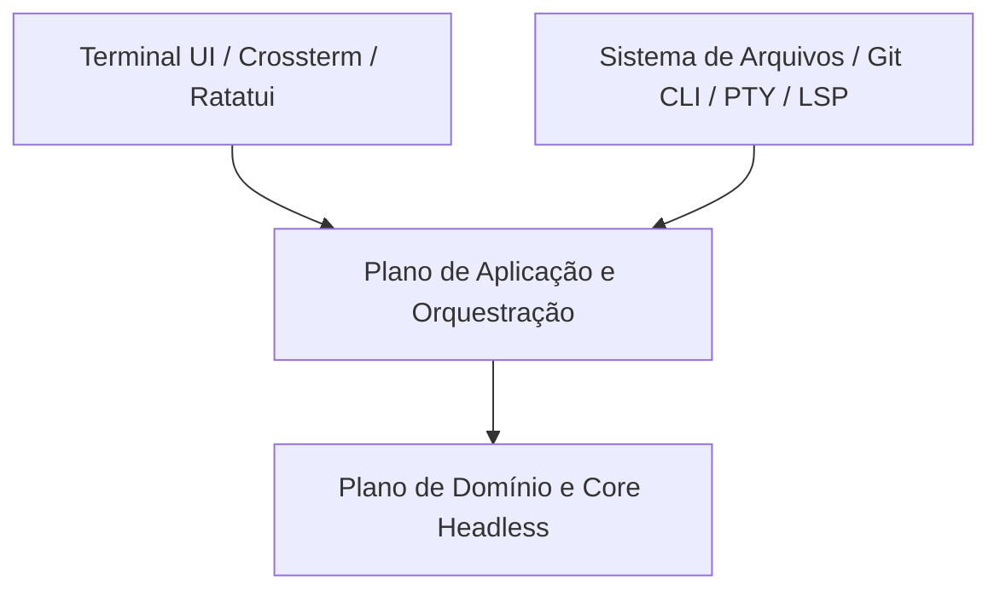

# Visão Geral de Arquitetura

## Topologia do Sistema

O projeto é estruturado em três planos concêntricos:

1. **Plano de Domínio**: Regras essenciais do editor, modelos de buffer em memória (Ropey) e validações puras sem dependência de terminal.
2. **Plano de Aplicação**: Casos de uso, orquestração de operações, loop de eventos e gerenciamento de tarefas/sessão.
3. **Plano de Adaptadores e Infraestrutura**: Drivers PTY (portable-pty), conectores de sistema de arquivos, integração Git CLI, clientes stdio de LSP e interface TUI via Ratatui/Crossterm.

## Diagrama Conceitual

