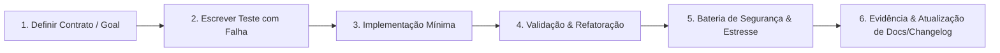

# Estratégia de Testes Exaustivos e Ciclo de Qualidade

Este documento codifica o **ciclo mandatório e rigoroso de testes e qualidade** aplicado a todas as implementações deste projeto. Nenhum código é integrado sem evidências automatizadas de aprovação em todos os níveis da pirâmide.

---

## 1. O Loop Rigoroso de Implementação (TDD / BDD)

Para cada nova funcionalidade ou correção de defeito:

1. **Definição de Contratos**: Especificar a interface, tipos e critérios de aceitação.
2. **Teste Inicial**: Criar teste que reproduza a falha ou verifique o comportamento esperado antes de codificar a solução.
3. **Implementação**: Escrever código limpo, modular e desacoplado que satisfaça o teste.
4. **Refatoração**: Aplicar princípios de Clean Code sem quebrar nenhum teste existente.
5. **Varredura Completa**: Executar suíte de conformidade, segurança, performance e estresse.
6. **Evidência e Changelog**: Atualizar documentação afetada e registrar a mudança no `CHANGELOG.md`.

---

## 2. As Camadas da Pirâmide de Testes

### A. Funcionalidade
- **Testes Unitários**: Determinísticos, rápidos (milissegundos), sem chamadas de rede ou I/O real. Cobertura mínima exigida: **85%**.
- **Testes de Integração**: Testam interações reais entre módulos, adaptadores de banco de dados e sistemas de arquivos com fixtures isoladas.
- **Testes de Contrato**: Validação de comunicação entre serviços e interfaces públicas.

### B. Conformidade e Validação Estática
- **Linters**: Verificação estrita de sintaxe, tipos e convenções.
- **Schemas**: Validação de todas as estruturas de entrada/saída contra esquemas JSON Draft 2020-12.
- **Formatação**: Zero divergência em relação ao padrão canônico.

### C. Segurança (DevSecOps)
- **Varredura de Segredos**: Proibição de chaves, senhas ou tokens no código (verificação automatizada pré-commit).
- **SAST (Static Application Security Testing)**: Análise estática contra injeção de comandos, XSS, SSRF e vulnerabilidades OWASP Top 10.
- **Auditoria de Dependências**: Detecção de CVEs e bibliotecas vulneráveis ou obsoletas na cadeia de suprimentos.
- **Princípio do Menor Privilégio**: Testes de permissões restritas em tempo de execução.

### D. Performance, Carga e Estresse
- **Benchmarks**: Medição contínua de latência e consumo de memória por operação.
- **Testes de Concorrência & Deadlock**: Detecção de condições de corrida, contenção de mutexes e verificação de segurança de threads em buffers e canais assíncronos.
- **Testes de Estresse & Carga**: Operações contínuas em buffers gigantes (Ropey) e saturação de eventos de entrada.

### E. Terminal UI e Experiência do Usuário (TUI)
- **Testes de Componentes & Widgets**: Renderização isolada e asserções sem TTY utilizando o `TestBackend` da biblioteca Ratatui.
- **Testes de Integração de Entrada**: Simulação de fluxos reais de digitação e sequências de escape do Crossterm sem necessidade de terminal físico.
- **Regressão Visual de Layout**: Asserção do buffer de células de caracteres para garantir estabilidade de splits, modais e barra de status.
- **Acessibilidade e Ergonomia**: Garantia de contraste de cores, suporte a temas claros/escuros e navegação 100% acessível via teclado.

---

## 3. Comandos de Execução Recomendados

| Categoria | Ferramenta Canônica | Comando Padrão |
|-----------|---------------------|----------------|
| Unitário & Integração | Cargo Test | `cargo test --workspace` |
| Formatação | Rustfmt | `cargo fmt --all -- --check` |
| Linter & Conformance | Clippy | `cargo clippy --all-targets -- -D warnings` |
| Auditoria de Segurança | Cargo Audit | `cargo audit` |
| Testes com Saída Completa | Cargo Test | `cargo test --workspace -- --nocapture` |
| Compilação Otimizada | Cargo Release | `cargo build --release` |
