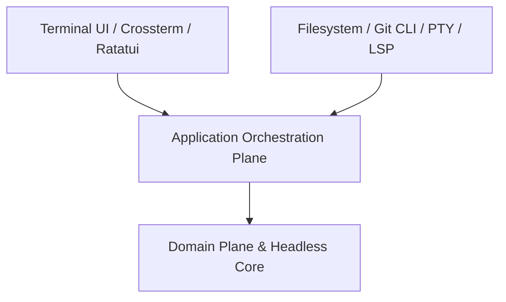

# Architecture Overview

## System Topology

The project is structured across three concentric planes:

1. **Domain Plane**: Core business rules, buffer models, and pure validations.
2. **Application Plane**: Use cases, workflow orchestration, and event loops.
3. **Adapters & Infrastructure Plane**: PTY drivers, filesystem connectors, Git integration, LSP stdio clients, and Ratatui terminal UI.

## Conceptual Diagram

