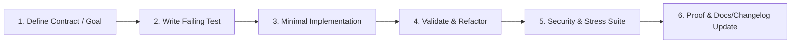

# Exhaustive Testing Strategy & Quality Lifecycle

This document defines the **mandatory and rigorous testing and quality cycle** applied to all implementations across this project. No code is integrated without automated proof of passing at all levels of the quality pyramid.

---

## 1. The Rigorous Implementation Loop (TDD / BDD)

For every new feature or bug fix:

1. **Contract Definition**: Specify public interface, types, and acceptance criteria.
2. **Failing Test**: Write a test reproducing the defect or verifying expected behavior prior to coding.
3. **Implementation**: Produce clean, modular, decoupled code that satisfies the test.
4. **Refactor**: Apply Clean Code principles without regressing any existing test.
5. **Full Sweep**: Run conformance, security, performance, and stress suites.
6. **Documentation & Changelog**: Update affected documentation and record changes in `CHANGELOG.md`.

---

## 2. Layers of the Testing Pyramid

### A. Functionality
- **Unit Tests**: Deterministic, ultra-fast (milliseconds), with zero network or real I/O. Minimum required coverage: **85%**.
- **Integration Tests**: Verify end-to-end interactions between modules, filesystem drivers, and process pipes.
- **Contract Tests**: Validate message payloads and public interface schemas.

### B. Conformance & Static Analysis
- **Linters**: Strict verification of syntax, types, and idioms (`cargo clippy --all-targets -- -D warnings`).
- **Formatting**: Zero deviation from canonical standards (`cargo fmt --all -- --check`).

### C. Security (DevSecOps)
- **Secret Scanning**: Automated detection of embedded tokens or credentials.
- **SAST**: Static analysis against command injections and OWASP vulnerabilities.
- **Supply Chain Security**: Auditing dependencies against known vulnerability databases (`cargo audit`).

### D. Performance & Stability
- **Benchmarks**: Continuous measurement of latency and memory allocation per editing operation.
- **Concurrency Verification**: Detection of race conditions, mutex contention, and thread safety across async channels.
- **Stress & Load Testing**: Continuous stress operations on large text buffers (Ropey) and input event saturation.

### E. Terminal UI & User Experience (TUI)
- **Component & Widget Tests**: Isolated rendering and headless assertions using Ratatui's `TestBackend`.
- **Input Integration Tests**: Simulation of realistic keystroke flows and Crossterm escape sequences without a physical TTY.
- **Visual Layout Stability**: Character-cell buffer assertions ensuring stability across splits, dialogs, and status bar.
- **Ergonomics & Accessibility**: Color contrast verification, dark/light theme support, and 100% keyboard navigability.

---

## 3. Recommended Execution Commands

| Category | Canonical Tool | Standard Command |
|---|---|---|
| Unit & Integration Tests | Cargo Test | `cargo test --workspace` |
| Formatting | Rustfmt | `cargo fmt --all -- --check` |
| Linter & Conformance | Clippy | `cargo clippy --all-targets -- -D warnings` |
| Security & Vulnerabilities | Cargo Audit | `cargo audit` |
| Tests with Full Output | Cargo Test | `cargo test --workspace -- --nocapture` |
| Optimized Build | Cargo Release | `cargo build --release` |
